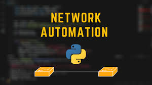

  <h1>بسم الله الرحمن الرحيم</h1>

  

# Network_Automation_Python
These scripts provide a simple network automation asynchronous framework for vendor-agnostic network

**File Structure:**

1. **BackupSwitchsConfig.py**
    * **Function Description:** Backs up the running configuration of multiple switches using telnet. 
    * **Input:** 
        * `username`: A text file containing the username for telnet access.
        * `password`: A text file containing the password for telnet access.
        * `MySwitchs`: A text file containing a list of switch IP addresses, one per line.
    * **Output:** 
        * `switch IP`:  A separate text file created for each switch, containing the backed-up configuration.

2. **clearS.py**
    * **Function Description:** Removes all VLANs from 2 to 50 on multiple switches using telnet.
    * **Input:** 
        * `username`: A text file containing the username for telnet access.
        * `password`: A text file containing the password for telnet access.
        * `MySwitchs`: A text file containing a list of switch IP addresses, one per line.
    * **Output:**  
        * Outputs the command results from the telnet sessions to the console.

3. **confSwitchs.py**
    * **Function Description:** Creates VLANs from 2 to 5 on multiple switches using telnet.
    * **Input:** 
        * `username`: A text file containing the username for telnet access.
        * `password`: A text file containing the password for telnet access.
        * `MySwitchs`: A text file containing a list of switch IP addresses, one per line.
    * **Output:**  
        * Outputs the command results from the telnet sessions to the console.

4. **fw_conf.py**
    * **Function Description:**  Creates VLANs from 2 to 50 on multiple switches using telnet. Utilizes functions defined in `TelNetSwitchs.py`. 
    * **Input:** 
        * `username`: A text file containing the username for telnet access.
        * `password`: A text file containing the password for telnet access.
        * `MySwitchs`: A text file containing a list of switch IP addresses, one per line.
    * **Output:**  
        * Outputs the command results from the telnet sessions to the console.

5. **fw_Rmv.py**
    * **Function Description:** Removes VLANs from 2 to 50 on multiple switches using telnet. Utilizes functions defined in `TelNetSwitchs.py`. 
    * **Input:** 
        * `username`: A text file containing the username for telnet access.
        * `password`: A text file containing the password for telnet access.
        * `MySwitchs`: A text file containing a list of switch IP addresses, one per line.
    * **Output:**  
        * Outputs the command results from the telnet sessions to the console.

6. **FW_th_rmv.py**
    * **Function Description:** Removes VLANs from 2 to 50 on multiple switches using telnet and threading. Utilizes functions defined in `TelNetSwitchs.py`.
    * **Input:** 
        * `username`: A text file containing the username for telnet access.
        * `password`: A text file containing the password for telnet access.
        * `MySwitchs`: A text file containing a list of switch IP addresses, one per line.
    * **Output:**  
        * Outputs the command results from the telnet sessions to the console.

7. **importTelent.py**
    * **Function Description:** Connects to a Cisco IOS device via telnet and performs basic configuration.
    * **Input:** 
        * Username and password entered interactively.
    * **Output:**  
        * Outputs the command results from the telnet sessions to the console.

8. **mclearS.py**
    * **Function Description:** Removes VLANs from 2 to 50 on multiple switches using telnet. Utilizes functions defined in `TelNetSwitchs.py`. 
    * **Input:** 
        * `username`: A text file containing the username for telnet access.
        * `password`: A text file containing the password for telnet access.
        * `MySwitchs`: A text file containing a list of switch IP addresses, one per line.
    * **Output:**  
        * Outputs the command results from the telnet sessions to the console.

9. **mconfs.py**
    * **Function Description:** Creates VLANs from 2 to 50 on multiple switches using telnet. Utilizes functions defined in `TelNetSwitchs.py`.
    * **Input:** 
        * `username`: A text file containing the username for telnet access.
        * `password`: A text file containing the password for telnet access.
        * `MySwitchs`: A text file containing a list of switch IP addresses, one per line.
    * **Output:**  
        * Outputs the command results from the telnet sessions to the console.

10. **netmiko1.py**
    * **Function Description:**  Connects to a Cisco IOS device using Netmiko library and performs basic configuration and VLAN creation. 
    * **Input:** 
        * Hardcoded device credentials.
    * **Output:**  
        * Outputs the command results from the Netmiko sessions to the console.

11. **Netmiko2.py**
    * **Function Description:** Connects to a Cisco IOS device using Netmiko library and performs basic configuration and VLAN creation. 
    * **Input:** 
        * Hardcoded device credentials.
    * **Output:**  
        * Outputs the command results from the Netmiko sessions to the console.

12. **scon.py**
    * **Function Description:** Connects to a Cisco IOS device via telnet and creates VLANs. 
    * **Input:** 
        * Username and password entered interactively.
    * **Output:**  
        * Outputs the command results from the telnet sessions to the console.

13. **scons.py**
    * **Function Description:** Connects to multiple Cisco IOS devices via telnet and creates VLANs.
    * **Input:** 
        * `username`: A text file containing the username for telnet access.
        * `password`: A text file containing the password for telnet access.
        * `MySwitchs`: A text file containing a list of switch IP addresses, one per line.
    * **Output:**  
        * Outputs the command results from the telnet sessions to the console.

14. **telnet switch config.py**
    * **Function Description:**  Backs up the running configuration of multiple switches using telnet. 
    * **Input:** 
        * `username`: A text file containing the username for telnet access.
        * `password`: A text file containing the password for telnet access.
        * `MySwitchs`: A text file containing a list of switch IP addresses, one per line.
    * **Output:** 
        * `switch IP`:  A separate text file created for each switch, containing the backed-up configuration.

15. **TelNetSwitchs.py**
    * **Function Description:** A library file containing functions for telnet connectivity, VLAN creation, and VLAN removal.
    * **Input:**  
        * None (functions take arguments for username, password, IP, and VLAN range).
    * **Output:**  
        * Functions perform actions on connected devices.

16. **testdef.py**
    * **Function Description:** Simple example demonstrating function calls and timing with the `time` module. 
    * **Input:**  
        * None
    * **Output:**  
        * Prints outputs from function calls.

17. **threadingexample.py**
    * **Function Description:** Demonstrates basic threading in Python, creating multiple threads that execute a simple function.
    * **Input:**  
        * None
    * **Output:**  
        * Prints outputs from threads.

# 

  <h1>بسم الله الرحمن الرحيم</h1>

# 

##  هيكل الملفات: 

1. **BackupSwitchsConfig.py**
    * **وصف الوظيفة:** يقوم هذا الملف باحتياطي إعدادات التشغيل لعدة أجهزة تبديل باستخدام بروتوكول Telnet. 
    * **المدخلات:**
        * `username`: ملف نصي يحتوي على اسم المستخدم للوصول عن طريق Telnet.
        * `password`: ملف نصي يحتوي على كلمة المرور للوصول عن طريق Telnet.
        * `MySwitchs`: ملف نصي يحتوي على قائمة عناوين IP لأجهزة التبديل، سطرًا واحدًا لكل عنوان.
    * **المخرجات:**
        * `switch IP`: ملف نصي منفصل تم إنشاؤه لكل جهاز تبديل، يحتوي على إعدادات الاحتياطي.

2. **clearS.py**
    * **وصف الوظيفة:** يقوم هذا الملف بإزالة جميع شبكات VLAN من 2 إلى 50 على عدة أجهزة تبديل باستخدام Telnet.
    * **المدخلات:**
        * `username`: ملف نصي يحتوي على اسم المستخدم للوصول عن طريق Telnet.
        * `password`: ملف نصي يحتوي على كلمة المرور للوصول عن طريق Telnet.
        * `MySwitchs`: ملف نصي يحتوي على قائمة عناوين IP لأجهزة التبديل، سطرًا واحدًا لكل عنوان.
    * **المخرجات:**
        * يُخرج نتائج الأوامر من جلسات Telnet إلى وحدة التحكم.

3. **confSwitchs.py**
    * **وصف الوظيفة:** يقوم هذا الملف بإنشاء شبكات VLAN من 2 إلى 5 على عدة أجهزة تبديل باستخدام Telnet.
    * **المدخلات:**
        * `username`: ملف نصي يحتوي على اسم المستخدم للوصول عن طريق Telnet.
        * `password`: ملف نصي يحتوي على كلمة المرور للوصول عن طريق Telnet.
        * `MySwitchs`: ملف نصي يحتوي على قائمة عناوين IP لأجهزة التبديل، سطرًا واحدًا لكل عنوان.
    * **المخرجات:**
        * يُخرج نتائج الأوامر من جلسات Telnet إلى وحدة التحكم.

4. **fw_conf.py**
    * **وصف الوظيفة:** يقوم هذا الملف بإنشاء شبكات VLAN من 2 إلى 50 على عدة أجهزة تبديل باستخدام Telnet. يستخدم الدوال المحددة في `TelNetSwitchs.py`. 
    * **المدخلات:**
        * `username`: ملف نصي يحتوي على اسم المستخدم للوصول عن طريق Telnet.
        * `password`: ملف نصي يحتوي على كلمة المرور للوصول عن طريق Telnet.
        * `MySwitchs`: ملف نصي يحتوي على قائمة عناوين IP لأجهزة التبديل، سطرًا واحدًا لكل عنوان.
    * **المخرجات:**
        * يُخرج نتائج الأوامر من جلسات Telnet إلى وحدة التحكم.

5. **fw_Rmv.py**
    * **وصف الوظيفة:** يقوم هذا الملف بإزالة شبكات VLAN من 2 إلى 50 على عدة أجهزة تبديل باستخدام Telnet. يستخدم الدوال المحددة في `TelNetSwitchs.py`. 
    * **المدخلات:**
        * `username`: ملف نصي يحتوي على اسم المستخدم للوصول عن طريق Telnet.
        * `password`: ملف نصي يحتوي على كلمة المرور للوصول عن طريق Telnet.
        * `MySwitchs`: ملف نصي يحتوي على قائمة عناوين IP لأجهزة التبديل، سطرًا واحدًا لكل عنوان.
    * **المخرجات:**
        * يُخرج نتائج الأوامر من جلسات Telnet إلى وحدة التحكم.

6. **FW_th_rmv.py**
    * **وصف الوظيفة:** يقوم هذا الملف بإزالة شبكات VLAN من 2 إلى 50 على عدة أجهزة تبديل باستخدام Telnet والتشغيل المتعدد. يستخدم الدوال المحددة في `TelNetSwitchs.py`.
    * **المدخلات:**
        * `username`: ملف نصي يحتوي على اسم المستخدم للوصول عن طريق Telnet.
        * `password`: ملف نصي يحتوي على كلمة المرور للوصول عن طريق Telnet.
        * `MySwitchs`: ملف نصي يحتوي على قائمة عناوين IP لأجهزة التبديل، سطرًا واحدًا لكل عنوان.
    * **المخرجات:**
        * يُخرج نتائج الأوامر من جلسات Telnet إلى وحدة التحكم.

7. **importTelent.py**
    * **وصف الوظيفة:** يقوم هذا الملف بالاتصال بجهاز Cisco IOS عبر Telnet ويُجري إعدادات أساسية.
    * **المدخلات:**
        * اسم المستخدم وكلمة المرور التي تم إدخالها بشكل تفاعلي.
    * **المخرجات:**
        * يُخرج نتائج الأوامر من جلسات Telnet إلى وحدة التحكم.

8. **mclearS.py**
    * **وصف الوظيفة:** يقوم هذا الملف بإزالة شبكات VLAN من 2 إلى 50 على عدة أجهزة تبديل باستخدام Telnet. يستخدم الدوال المحددة في `TelNetSwitchs.py`. 
    * **المدخلات:**
        * `username`: ملف نصي يحتوي على اسم المستخدم للوصول عن طريق Telnet.
        * `password`: ملف نصي يحتوي على كلمة المرور للوصول عن طريق Telnet.
        * `MySwitchs`: ملف نصي يحتوي على قائمة عناوين IP لأجهزة التبديل، سطرًا واحدًا لكل عنوان.
    * **المخرجات:**
        * يُخرج نتائج الأوامر من جلسات Telnet إلى وحدة التحكم.

9. **mconfs.py**
    * **وصف الوظيفة:** يقوم هذا الملف بإنشاء شبكات VLAN من 2 إلى 50 على عدة أجهزة تبديل باستخدام Telnet. يستخدم الدوال المحددة في `TelNetSwitchs.py`. 
    * **المدخلات:**
        * `username`: ملف نصي يحتوي على اسم المستخدم للوصول عن طريق Telnet.
        * `password`: ملف نصي يحتوي على كلمة المرور للوصول عن طريق Telnet.
        * `MySwitchs`: ملف نصي يحتوي على قائمة عناوين IP لأجهزة التبديل، سطرًا واحدًا لكل عنوان.
    * **المخرجات:**
        * يُخرج نتائج الأوامر من جلسات Telnet إلى وحدة التحكم.

10. **netmiko1.py**
    * **وصف الوظيفة:** يقوم هذا الملف بالاتصال بجهاز Cisco IOS باستخدام مكتبة Netmiko ويُجري إعدادات أساسية وإنشاء شبكات VLAN.
    * **المدخلات:**
        * بيانات اعتماد الجهاز المشفرة.
    * **المخرجات:**
        * يُخرج نتائج الأوامر من جلسات Netmiko إلى وحدة التحكم.

11. **Netmiko2.py**
    * **وصف الوظيفة:** يقوم هذا الملف بالاتصال بجهاز Cisco IOS باستخدام مكتبة Netmiko ويُجري إعدادات أساسية وإنشاء شبكات VLAN.
    * **المدخلات:**
        * بيانات اعتماد الجهاز المشفرة.
    * **المخرجات:**
        * يُخرج نتائج الأوامر من جلسات Netmiko إلى وحدة التحكم.

12. **scon.py**
    * **وصف الوظيفة:** يقوم هذا الملف بالاتصال بجهاز Cisco IOS عبر Telnet ويُنشئ شبكات VLAN.
    * **المدخلات:**
        * اسم المستخدم وكلمة المرور التي تم إدخالها بشكل تفاعلي.
    * **المخرجات:**
        * يُخرج نتائج الأوامر من جلسات Telnet إلى وحدة التحكم.

13. **scons.py**
    * **وصف الوظيفة:** يقوم هذا الملف بالاتصال بـعدة أجهزة Cisco IOS عبر Telnet ويُنشئ شبكات VLAN.
    * **المدخلات:**
        * `username`: ملف نصي يحتوي على اسم المستخدم للوصول عن طريق Telnet.
        * `password`: ملف نصي يحتوي على كلمة المرور للوصول عن طريق Telnet.
        * `MySwitchs`: ملف نصي يحتوي على قائمة عناوين IP لأجهزة التبديل، سطرًا واحدًا لكل عنوان.
    * **المخرجات:**
        * يُخرج نتائج الأوامر من جلسات Telnet إلى وحدة التحكم.

14. **telnet switch config.py**
    * **وصف الوظيفة:** يقوم هذا الملف باحتياطي إعدادات التشغيل لعدة أجهزة تبديل باستخدام بروتوكول Telnet. 
    * **المدخلات:**
        * `username`: ملف نصي يحتوي على اسم المستخدم للوصول عن طريق Telnet.
        * `password`: ملف نصي يحتوي على كلمة المرور للوصول عن طريق Telnet.
        * `MySwitchs`: ملف نصي يحتوي على قائمة عناوين IP لأجهزة التبديل، سطرًا واحدًا لكل عنوان.
    * **المخرجات:**
        * `switch IP`:  ملف نصي منفصل تم إنشاؤه لكل جهاز تبديل، يحتوي على إعدادات الاحتياطي.

15. **TelNetSwitchs.py**
    * **وصف الوظيفة:** ملف مكتبة يحتوي على دوال لاتصال Telnet، وإنشاء شبكات VLAN، وإزالة شبكات VLAN.
    * **المدخلات:**
        * لا يوجد (تستقبل الدوال وسيطات لاسم المستخدم وكلمة المرور و IP ونطاق VLAN).
    * **المخرجات:**
        * تقوم الدوال بأداء إجراءات على الأجهزة المتصلة.

16. **testdef.py**
    * **وصف الوظيفة:** مثال بسيط يوضح استدعاء الدوال والتوقيت باستخدام وحدة `time`.
    * **المدخلات:**
        * لا يوجد
    * **المخرجات:**
        * يطبع نتائج استدعاء الدوال.

17. **threadingexample.py**
    * **وصف الوظيفة:** يوضح هذا الملف الترابط الأساسي في Python، حيث يتم إنشاء ترابطات متعددة تنفذ دالة بسيطة.
    * **المدخلات:**
        * لا يوجد
    * **المخرجات:**
        * يطبع نتائج الترابط.

